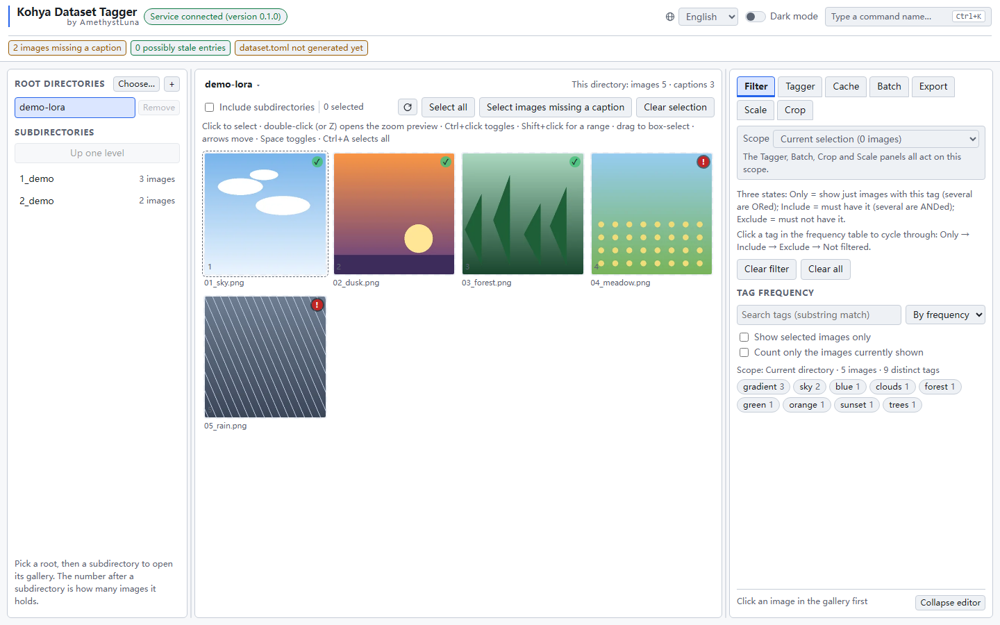

<h1 align="center">Kohya Dataset Tagger</h1>

<p align="center">
  <a href="README.zh-CN.md">简体中文</a> ·
  <a href="README.md">English</a> ·
  <a href="README.ja.md">日本語</a>
</p>

<p align="center">
  <a href="https://github.com/AmethystLuna/kohya-dataset-tagger/actions/workflows/ci.yml"></a>
  <a href="LICENSE"></a>
  <a href="https://www.python.org/downloads/"></a>
</p>

<p align="center">
  
</p>

A standalone tagger for **kohya-style training sets**. LoRA, full finetune and DreamBooth all use the same `image_dir` + `.txt` sidecar layout, and the whole chain runs in the browser:

**browse the directory → preview the gallery → edit tags per image → filter by tag → batch-caption with WD14 → generate a trainable `dataset.toml`**

It runs as its own app, with its own process and page, and works directly on the files the dataset already has: the `.txt` caption beside each image, the training caches, and `dataset.toml`.

## Install and run

| Task | Windows | Linux / macOS |
|---|---|---|
| First time: create the environment | `setup_env.bat` | `./setup_env.sh` |
| Every time: start and open the browser | `start.bat` | `./start.sh` |
| The same two, from the China mirrors | `setup_env_cn.bat` | `./setup_env_cn.sh` |

Before the page opens, the launcher

- if `.venv` is missing, asks whether to initialise it;
- asks once for the dataset root directory and stores it in `roots.txt` (gitignored), so it never asks again;
- moves to the next free port when one is taken (3001 → 3002 → …);
- opens the browser only once the service answers, so you never land on a page that cannot connect;
- runs in the foreground, and Ctrl+C stops it.

Both launcher sets accept `--dry-run`: print the command lines, start nothing.

Or start the service directly:

```powershell
.\scripts\start.ps1 -Roots "D:\datasets\my-lora" -Port 3001
.\scripts\start.ps1 -NoBrowser
```

The environment scripts take flags of their own:

```powershell
.\setup_env.bat -Gpu cuda        # use the CUDA EP (needs torch or the nvidia runtime)
.\setup_env.bat -Gpu cpu
.\setup_env.bat -Index cn        # China-mirror profile (equivalent to setup_env_cn.bat)
.\setup_env.bat -DryRun          # only print the choices that would be executed, install nothing
.\setup_env.bat -Recreate        # rebuild the venv (prints the absolute path and asks for confirmation first)
```

The only dependency is this repository's own `.venv` (about 250 MB). **torch is not needed.** Do not install anything into the trainer's venv.

**On a mainland-China network** use `setup_env_cn.*`: same implementation, different package sources. It tries `USTC → Aliyun → pypi.org` in order, moving on only when the previous one fails, so a mirror being down does not stop the install. Measured on 2026-09-19 while fetching the 245 MB `onnxruntime-gpu`: USTC 8.4–11 MB/s, Aliyun 0.86–1.25 MB/s, pypi.org 0.55–1.01 MB/s. For another mirror set `KOHYA_TAGGER_PIP_INDEX=https://your/simple` (comma-separated for several, tried in order).

## GPU

onnxruntime decides the speed, so the Windows setup scripts install the **DirectML** build by default: 50 MB, self-contained, vendor-agnostic, no CUDA or cuDNN needed. Measured on the reference machine (RTX 4070 Ti SUPER, 16 images, median after warm-up):

| provider | per image | a 1653-image dataset |
|---|---|---|
| CPU | 0.721 s | 19.9 minutes |
| **DirectML** (default) | **0.192 s** | **5.3 minutes** |
| CUDA | 0.168 s | 4.6 minutes |

CUDA is 14% faster; it costs 195 MB more plus a torch dependency.

An onnxruntime install must pin `--index-url` (both setup scripts already do): the global pip index can be slow enough to look hung - 0.07 MB/s measured on the reference machine. On a mainland-China network, `setup_env_cn.*` pins a domestic mirror instead. Then check which provider the session really uses:

```powershell
.\.venv\Scripts\python.exe tools\check_provider.py    # builds a session with a real model and reports the provider in use
```

A provider that fails to load makes onnxruntime **fall back to CPU silently**: inference still runs, four times slower. `get_available_providers()` reports the providers that are registered; only `InferenceSession.get_providers()` reports the one a session uses.

## Tagger models

Selecting a model that is not on disk downloads it, trying `KOHYA_TAGGER_HF_ENDPOINT` → `huggingface.co` → `hf-mirror.com` (a China mirror whose manifest was verified to match the main site).

Search roots are used in this order, and the first match wins for a duplicate model name:

1. `models/` in this repository - the first root, and the default download destination
2. directories you added (`model_paths.txt`, then `--extra-models` / `KOHYA_TAGGER_EXTRA_MODELS`)
3. `%LOCALAPPDATA%/kohya-dataset-tagger/models` - the app's own download directory
4. the HuggingFace cache, last

**Adding a directory is easiest in the UI**: tagger panel → "Model directories…" → paste an absolute path. The entry takes effect immediately, with no restart, and is written back to `model_paths.txt`. Three equivalents:

```powershell
# 1. Edit model_paths.txt (one path per line; # starts a comment, semicolons also separate) - read at startup
# 2. Environment variable (appends, does not replace):
set KOHYA_TAGGER_EXTRA_MODELS=D:\my-taggers;E:\more
# 3. Run the CLI directly (the launcher has no -ExtraModels argument):
.\.venv\Scripts\python.exe -m kohya_dataset_tagger --roots "<dataset>" --extra-models "D:\my-taggers"
```

`--models` / `KOHYA_TAGGER_MODELS` is the other flag: it **replaces** the whole search list, the repository's `models/` and every auto-discovered location included, so to add one directory, use the append above.

Wherever your webui / ComfyUI models are, write that directory into `model_paths.txt`.

**To use a model without downloading it**, put `model.onnx` and the `*.csv` from the same repository into

```text
models/<model-id>/
```

a directory that already holds a placeholder file whose file name says exactly that. It is the first search root and the default download destination, so what you place by hand and what the app downloads live in the same place.

## Datasets and model directories without a restart

Both kinds of path are editable in the UI, with immediate effect:

| What you want | Where | Effect |
|---|---|---|
| Switch or add a dataset directory | the **+** next to the "Root directories" title in the left column | browsable immediately; written back to `roots.txt` |
| Remove a dataset directory | "Remove" after each root | the last one cannot be removed (with none left, nothing opens) |
| Add a model search directory | tagger panel → "Model directories…" | in the model list immediately; written back to `model_paths.txt` |
| Remove a model search directory | "Remove" on each entry in the same dialog | auto-discovered entries last for this run only, and the UI says so |

**Paste an absolute path**: a browser has no native directory picker, and the directory must already exist - a root that does not exist only makes every request 403 or 404.

When the file cannot be written the feature **still works**, and the UI says "this entry will be lost after a restart".

## FAQ

**A cache file disappeared when I saved a caption.** Editing a `.txt` also deletes the matching `cache_text_encoder/<name>_anima_te.safetensors`; without that, training keeps using the old tags ([why](.github/memory/encoder-cache-invalidation.md)).

**Does it touch my images?** A confirmed crop writes one image beside its source as `<stem>_1` and leaves the original alone. Everything else writes `.txt` captions and `dataset.toml`.

**Why did the export report warnings?** They are the six things worth fixing before a training run: a missing caption, a caption containing `\,` (read as two tags), an image larger than `max_bucket_reso`, an image with alpha, too few images, and an empty directory.

**Can I pass model directories to the launcher?** No: `setup_env.*` and `start.*` take the port and the root directory only. Model directories live in the UI and `model_paths.txt`, so a directory you removed stays removed (§3.7).

## Contributing

Issues and pull requests are welcome, in English or Chinese; work on the tool itself starts at [AGENTS.md](AGENTS.md). [CONTRIBUTING.md](CONTRIBUTING.md) has the setup, the two-tier gate, the rules a change has to respect and what CI runs. Security problems go through [SECURITY.md](SECURITY.md); the project follows the [Contributor Covenant](CODE_OF_CONDUCT.md).

## License

[MIT](LICENSE) © 2026 AmethystLuna.
