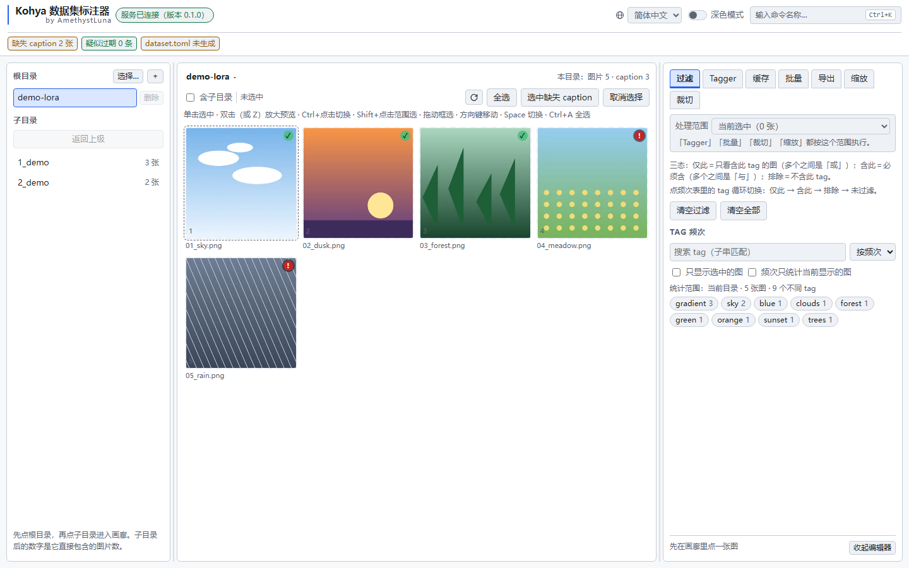

<h1 align="center">Kohya Dataset Tagger</h1>

<p align="center">
  <a href="README.zh-CN.md">简体中文</a> ·
  <a href="README.md">English</a> ·
  <a href="README.ja.md">日本語</a>
</p>

<p align="center">
  <a href="https://github.com/AmethystLuna/kohya-dataset-tagger/actions/workflows/ci.yml"></a>
  <a href="LICENSE"></a>
  <a href="https://www.python.org/downloads/"></a>
</p>

<p align="center">
  
</p>

一个面向 **kohya 风格训练集**的独立标注器。LoRA、全量微调、DreamBooth 用的是同一套 `image_dir` + `.txt` sidecar 结构，整条链路都在浏览器里完成：

**浏览目录 → 画廊预览 → 逐图编辑 tag → 按 tag 过滤 → WD14 批量打标 → 生成可直接训练的 `dataset.toml`**

它以独立应用的形式运行，有自己的进程和页面，直接操作数据集里已有的文件：每张图旁边的 `.txt` caption、训练缓存、`dataset.toml`。

## 安装与运行

| 要做什么 | Windows | Linux / macOS |
|---|---|---|
| 第一次：创建环境 | `setup_env.bat` | `./setup_env.sh` |
| 每次：启动并打开浏览器 | `start.bat` | `./start.sh` |
| 同样的两件事，走国内镜像 | `setup_env_cn.bat` | `./setup_env_cn.sh` |

打开页面之前，启动器会

- 没有 `.venv` 就先问要不要初始化；
- 首次询问数据集根目录，存进 `roots.txt`（已 gitignore），以后不再问；
- 端口被占用就换下一个（3001 → 3002 → …）；
- 服务真的应答之后才打开浏览器，所以不会出现打不开的页面；
- 在前台运行，Ctrl+C 结束。

两套启动器都接受 `--dry-run`：只打印命令行，什么都不启动。

也可以直接启动服务：

```powershell
.\scripts\start.ps1 -Roots "D:\datasets\my-lora" -Port 3001
.\scripts\start.ps1 -NoBrowser
```

环境脚本有自己的开关：

```powershell
.\setup_env.bat -Gpu cuda        # 用 CUDA EP（需要 torch 或 nvidia 运行时）
.\setup_env.bat -Gpu cpu
.\setup_env.bat -Index cn        # 国内镜像档（等价于 setup_env_cn.bat）
.\setup_env.bat -DryRun          # 只打印会执行的选择，不装任何东西
.\setup_env.bat -Recreate        # 重建 venv（先打印绝对路径并征求确认）
```

唯一的依赖是本仓库自己的 `.venv`（约 250 MB）。**不需要 torch**，也不要往训练器的 venv 里装任何东西。

**中国大陆网络**用 `setup_env_cn.*`：同一份实现，只是包源不同。它按 `USTC → 阿里云 → pypi.org` 的顺序尝试，前一个失败才换下一个，所以某个镜像临时挂了也装得上。2026-09-19 拉取 245 MB 的 `onnxruntime-gpu` 时实测：USTC 8.4–11 MB/s，阿里云 0.86–1.25 MB/s，pypi.org 0.55–1.01 MB/s。想换别的镜像就设 `KOHYA_TAGGER_PIP_INDEX=https://your/simple`（多个用逗号分隔，按顺序尝试）。

## GPU

速度由 onnxruntime 决定，所以 Windows 的安装脚本默认装 **DirectML** 版：50 MB、自带、不挑厂商，不需要 CUDA 或 cuDNN。在参考机器上实测（RTX 4070 Ti SUPER，16 张图，预热后取中位数）：

| 提供程序 | 每张图 | 1653 张的数据集 |
|---|---|---|
| CPU | 0.721 秒 | 19.9 分钟 |
| **DirectML**（默认） | **0.192 秒** | **5.3 分钟** |
| CUDA | 0.168 秒 | 4.6 分钟 |

CUDA 快 14%，代价是多 195 MB 外加一个 torch 依赖。

装 onnxruntime 必须钉住 `--index-url`（两个安装脚本都已经这么做了）：全局 pip 源可能慢到看起来像卡死——参考机器上实测 0.07 MB/s。中国大陆网络用 `setup_env_cn.*`，它钉的是国内镜像。装完确认 session 实际用的是哪个提供程序：

```powershell
.\.venv\Scripts\python.exe tools\check_provider.py    # 用真实模型建一个 session，报告实际生效的提供程序
```

提供程序加载失败时 onnxruntime 会**静默回退到 CPU**：推理照跑，慢 4 倍。`get_available_providers()` 报的是已注册的提供程序，只有 `InferenceSession.get_providers()` 报的是 session 实际使用的那个。

## Tagger 模型

选中的模型本地没有就自动下载，依次尝试 `KOHYA_TAGGER_HF_ENDPOINT` → `huggingface.co` → `hf-mirror.com`（国内镜像，其清单已验证与主站一致）。

搜索根按下面的顺序使用，同名模型取最前面的：

1. 本仓库的 `models/`——第一个搜索根，也是默认下载目的地
2. 自己加的目录（`model_paths.txt`，然后是 `--extra-models` / `KOHYA_TAGGER_EXTRA_MODELS`）
3. `%LOCALAPPDATA%/kohya-dataset-tagger/models`——程序自己的下载目录
4. HuggingFace 缓存，排在最后

**最省事的加目录办法是在界面里**：Tagger 面板 →「模型目录…」→ 粘贴绝对路径。加进去立即生效，不用重启，并写回 `model_paths.txt`。另外三种等价做法：

```powershell
# 1. 编辑 model_paths.txt（一行一个路径；# 开头是注释，分号也可以分隔）——启动时读取
# 2. 环境变量（追加，不替换）：
set KOHYA_TAGGER_EXTRA_MODELS=D:\my-taggers;E:\more
# 3. 直接跑 CLI（启动器没有 -ExtraModels 参数）：
.\.venv\Scripts\python.exe -m kohya_dataset_tagger --roots "<dataset>" --extra-models "D:\my-taggers"
```

`--models` / `KOHYA_TAGGER_MODELS` 是另一个开关：它**替换整个搜索列表**，仓库的 `models/` 和所有自动发现的位置都会一起丢掉，所以「再加一个目录」用上面的追加。

webui / ComfyUI 模型放在哪，就把那个目录写进 `model_paths.txt`。

**不想下载模型**：把同一个仓库的 `model.onnx` 和 `*.csv` 放进

```text
models/<model-id>/
```

这个目录里已经有一个占位文件，文件名说的就是这件事。它既是第一个搜索根，也是默认下载目的地，所以手放的和自动下载的在同一处。

## 切换数据集 / 添加模型目录：不用重启

这两类路径都能在界面里改，立即生效：

| 要做什么 | 在哪里 | 效果 |
|---|---|---|
| 切换或添加数据集目录 | 左栏「根目录」标题旁的 **＋** | 立刻可浏览；写回 `roots.txt` |
| 删除数据集目录 | 每个根目录后面的「删除」 | 最后一个删不掉（一个都不剩就打不开任何东西） |
| 添加模型搜索目录 | Tagger 面板 →「模型目录…」 | 立刻出现在模型列表里；写回 `model_paths.txt` |
| 删除模型搜索目录 | 同一个对话框里每项的「移除」 | 自动发现的那些只在本次运行生效，界面会说明 |

**请粘贴绝对路径**：浏览器没有原生目录选择器，而且目录必须已经存在——配一个不存在的根，只会让每个请求都 403 或 404。

写文件失败时功能**照样能用**，界面会直接说「重启后这条会丢」。

## 常见问题

**保存 caption 后缓存文件不见了。** 写入 `.txt` 会同时删掉配对的 `cache_text_encoder/<name>_anima_te.safetensors`；不删的话训练会一直用旧 tag（[原因](.github/memory/encoder-cache-invalidation.md)，英文）。

**它会动我的图片吗？** 只有确认过的裁剪会在原图旁边写出一张 `<stem>_1`，原图不动。其余只写 `.txt` caption 和 `dataset.toml`。

**导出为什么报了一堆警告？** 那是训练前值得处理的六件事：缺 caption、caption 里含 `\,`（会被读成两个 tag）、图片大于 `max_bucket_reso`、图片带 alpha、图片太少、空目录。

**能给启动器传模型目录吗？** 不能：`setup_env.*` 和 `start.*` 只接受端口和根目录。模型目录由界面和 `model_paths.txt` 管理，所以删掉的目录不会自己回来（§3.7）。

## 参与贡献

欢迎提 issue 和 PR，中英文都可以；要改这个工具本身，从 [AGENTS.md](AGENTS.md)（英文）开始。[CONTRIBUTING.md](CONTRIBUTING.md)（英文）里有环境搭建、两级闸门、改动必须遵守的规则，以及 CI 跑什么。安全问题请走 [SECURITY.md](SECURITY.md)（英文）；项目遵循 [Contributor Covenant](CODE_OF_CONDUCT.md)（英文）。

## 许可证

[MIT](LICENSE) © 2026 AmethystLuna。
